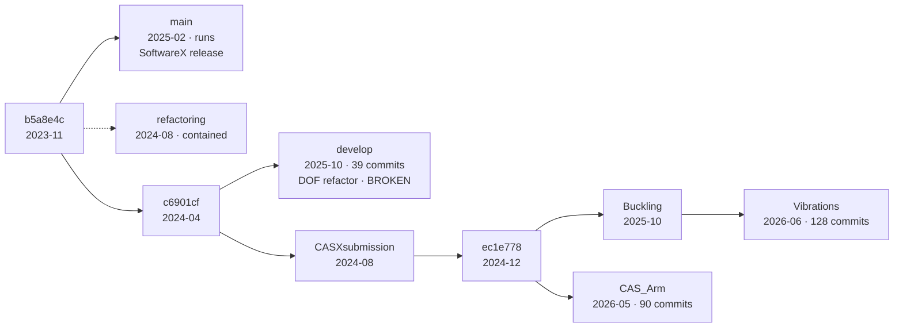

# MorphoGen — Branch Integration Plan

**Status:** proposal · **Surveyed:** 2026-09-10 · **Target:** `develop`

All branch topology and conflict counts in this document were measured with `git merge-tree`
against real merge bases. All runtime health claims were verified by running examples headless
in MATLAB R2025b (`matlab -batch`, figures suppressed) from detached worktrees.

The constraints governing this work are in [integration-rules.md](integration-rules.md) — read
those first; they decide what this plan is allowed to do.

An illustrated version of this document is published at
<https://claude.ai/code/artifact/fa4c624d-6d69-4161-a4fb-a4faa4d7013e>.

---

## 1. Summary

MorphoGen has seven remote branches, but not seven bodies of work. Four form a containment
chain in which each is fully contained by the next. **Two branches hold unmerged research** —
`Vibrations` and `CAS_Arm` — alongside `develop`'s own architectural line.

Three findings drive everything below:

| | Finding |
|---|---|
| **Blocking** | `develop` does not run. Its DOF refactor is half-finished: `FiniteElement` renamed `ndofs`→`eDofs` and `sf`→`shapeFn`, but 11 files still read the old names. |
| **Divergence** | Three incompatible assembly APIs. `CAS_Arm` extends develop's; `Vibrations` replaces it. |
| **Scope** | Of 73 merge conflicts, only **43 hunks across 14 library files** are real work. The rest is dead code and example scripts colliding over shared paths. |

`main` is a separate case: it is the SoftwareX publication line, it has not moved since
February 2025, and **it still works**. That gives it two roles — a numerical reference to
validate the merge against, and eleven files that exist nowhere else — four of them
topology-optimisation classes, not scripts.

---

## 2. Branch topology



`CASXsubmission` and `Buckling` are **strict ancestors** of `Vibrations` — zero unique commits.

| Branch | Tip | Unique commits | Disposition |
|---|---|---:|---|
| `develop` | 2025-10-21 | 39 | **Merge target.** Holds the DOF-manager rewrite. |
| `Vibrations` | 2026-06-26 | 128 | **Merge.** Newest tip; contains Buckling + CASXsubmission. |
| `CAS_Arm` | 2026-05-20 | 90 | **Merge.** 145-file arm study; only branch that runs. |
| `Buckling` | 2025-10-30 | 0 | Ancestor of Vibrations → tag `paper/buckling` |
| `CASXsubmission` | 2024-08-19 | 0 | Ancestor of all three → tag `paper/casx-2024` |
| `main` | 2025-02-24 | 23 | **Runs.** Numerical oracle; port 11 orphans (incl. 4 design classes) before re-pointing. |
| `refactoring` | 2024-08-19 | 14 | Fully contained by basename — no unique files → tag and retire |

---

## 3. Write policy

Each branch is the record of a paper or task. A record is not a place to do work.

| Branch | Writable | Rule |
|---|---|---|
| `develop` | yes | The only branch that receives work. |
| `prep/*`, `integration/*` | yes | Disposable scaffolding; deleted after the merge. |
| `main` | release only | Fast-forwarded from develop. Never developed on. |
| `Vibrations`, `CAS_Arm`, `Buckling`, `CASXsubmission`, `refactoring` | **no** | Publication records. Detached checkout only. |

Consequences: the Phase 3 triage happens on **prep branches cut from** the study branches,
never on the study branches themselves. And branch tips should become tags — a tag is what a
frozen record should be; a branch is a pointer that merely happens not to have moved yet.

> Not verified: `gh` is not installed locally, so it is unknown whether GitHub enforces this
> via branch protection or whether it is convention only.

---

## 4. Measured health

```
$ EXSCRIPT=examples/elasticity/planeProblems/CantileverTest.m matlab -batch ...

develop      FAIL  Not enough input arguments.
                     at FEModel.FEModel line 10
                     at ModelLinear.ModelLinear
Vibrations   FAIL  Undefined function 'LinearElasticityWeighted'
                     at CantileverModelLinear line 15
CAS_Arm      OK

$ # re-run against an example native to each branch's own layout
Vibrations   OK    examples/Pillar/quickTest.m
main         OK    examples/benchmarkProblems/Cantilever.m       (+1-line fix)
main         OK    examples/modularStructures/TrussZ_bending.m   (+1-line fix)
```

### 4.1 develop — an unfinished rename

`FiniteElement` declares `eDofs` and `shapeFn`. Eleven files still reference `obj.ndofs`,
eight still reference `obj.sf` — properties that no longer exist:

```
computeStifnessMatrix FAILED:
  Unrecognized method, property, or field 'ndofs' for class 'PlaneStressElem'
```

Also on develop:

- `FEModel` constructor now requires `(felems, mesh)`; `ModelLinear` and `ModelLinearLoad`
  still construct it bare.
- `Frame2D.computeStifnessMatrix` multiplies by `Ke`, which is **never assigned anywhere in
  the file**. It should be `Kl(:,:,k)`, computed two lines above.

### 4.2 main — working, behind a one-line MATLAB incompatibility

Every example fails at the same line of `FEAnalysis.plotSupport`:

```
281:   for k=1:size(irots)     % size() returns [n 1]; the colon operator needs a scalar
```

A plotting call, not a solver call, and a *version* problem rather than a logic problem: older
MATLAB tolerated a non-scalar colon operand, R2025b rejects it. `develop` already fixed it to
`1:max(size(irots))`; both feature branches refactored the function away. The pattern appears
nowhere else in the repository. With that one fix applied locally, main runs clean.

**Eleven of main's files exist on no other branch.** Six are example scripts; the other five
are *library* code, which matters far more. The rest of main's examples were relocated, not lost
— `Beam99.m` and friends live under `examples/topologyOpt/benchmarks/` downstream.

Library (added on main in `58535be`, 2024-04-23 "SoftX c.d." — written for the SoftwareX paper
*after* develop had diverged, so they were never on develop's line at all):

| File | Note |
|---|---|
| `design/FatigueConstrainedTopologyOptimization.m` | no successor downstream |
| `design/ReliabilityConstrainedTopologyOptimization.m` | no successor downstream |
| `design/StressConstrainedTopologyOptimization.m` | possibly superseded by the `StressIntensity*` family — different formulation, needs a call |
| `design/TopologyOptimization99.m` | the classic 99-line reference implementation |
| `analysis/ElastoPlasticAnalysis.m` | **safe to drop** — deliberately deleted on develop's line in `a6b112a` (2023-11-13) and superseded by `ElastoPlasticity.m` |

Examples:

- `RobotArm.m`, `CantileverVarCutThreshold.m`
- `TrussZ_bending_shear.m`, `TrussZ_bending_torsion.m`, `TrussZ_shear_torsion.m`,
  `TrussZ_iterative_plots_torsion.m`

The `cutThreshold` feature itself survives on `Vibrations`. Fast-forwarding `main` would drop
four published topology-optimisation capabilities, not merely six scripts — an earlier count of
six came from scanning only `examples/`.

### 4.3 Vibrations — a consolidation with 51 stale callers

In `334fa7f` (2025-11-20) `LinearElasticityWeighted` was deliberately folded into
`LinearElasticity`, which gained an `isConst` constructor flag and a density argument on
`solve(x)`. The consolidation is sound and its own examples pass. The caller migration was not
done: **51 files still reference the deleted class.**

---

## 5. Principle — a branch is a paper; the repo keeps examples

The library converges; each study lands as its own folder under `examples/`. A study that needs
a capability the library lacks *extends* the library — it does not fork it.

### 5.1 CAS_Arm already proves it

The arm work moved to a self-contained `examples/ManipulatorArm/` in January 2026 and grew to
145 files. Effect on merge cost:

| Merge | Example layout | Example conflicts |
|---|---|---|
| `develop ← Vibrations` | shared `examples/models/`, `topologyOpt/tests/` | 10 files · 29 hunks |
| `develop ← CAS_Arm` | partly relocated | 6 files · 13 hunks |
| **`Vibrations ← CAS_Arm`** | **arm study self-contained** | **1 file · 1 hunk** |

Eighteen months of parallel work, 145 files — one conflicting example script.

### 5.2 Study register

Which paper each branch belongs to is currently recorded nowhere — not in `README.md`, not in
the branches, only in the branch names, and those are cryptic (`CASXsubmission`, `CAS_Arm`).
This is the gap that makes the whole history hard to reason about, so the register starts here
and moves into per-study `README.md` files during Phase 3.

| Study | Branch | Folder after merge | Publication |
|---|---|---|---|
| Robotic arm | `CAS_Arm` | `examples/ManipulatorArm/` *(exists)* | [Overleaf](https://www.overleaf.com/project/688de221e7936ceed901d5a6) — in preparation |
| Beam vibrations | `Vibrations` | `examples/Vibrations/` *(Phase 3)* | *to fill in* |
| Pillar | `Vibrations` | `examples/Pillar/` *(exists)* | *to fill in* |
| Buckling | `Buckling` ⊂ `Vibrations` | folded into the above | *to fill in* |
| CAS submission | `CASXsubmission` ⊂ all | folded into the above | *to fill in* |
| SoftwareX release | `main` | `examples/benchmarkProblems/`, `examples/modularStructures/` | *DOI to fill in* |

Note that `Vibrations` carries **two** studies — the beam-vibration work and the Pillar model.
They separate cleanly into two folders at Phase 3; the branch name only ever named one of them,
which is itself an argument for the folder-per-study convention.

Two cautions on links. An Overleaf project URL is access-controlled, not a citation — it is
useful to collaborators and opaque to everyone else, so once a study is published the DOI should
sit beside it. And the link belongs in the study's `README.md`, never in the code.

### 5.3 What leaked into the library

Every file each branch added to `analysis/`, `design/`, `elements/`, classified by who calls it:

| Class | Vib | Arm | Files | Disposition |
|---|---:|---:|---|---|
| **Dead** — referenced by nothing | 5 | 2 | `Frame2D`, `StressIntensityTopologyOptimizationVol2` (both branches); `FreeVibrationsTopologyOpt`, `StressIntensityTopologyOptimizationMultiLoad`, `SolidElasticElem-old` (Vibrations) | **delete** |
| **Study-only** — called solely by one study's examples | 0 | 5 | `pullbackFullArmSensitivity`, `pullbackFullArmAverageIntensity`, `buildLinkedSensitivityMap`, `SIMP_MMA_ReferenceModuleMultiLoadCompliance`, `solveSIMPVolumeComplianceMMA` | **demote** to that study's `HelperFunctions/` |
| **Genuine capability** | 12 | 15 | `LinearStability`, `LinearNaturalVibration`, `SecondOrderElasticityWeighted`, `ElasticHarmonicVibrations`, `Frame3D`, `StressIntensityMulti{,Av,Max}TopologyOptimization`, … | **converge** — this is the library |

> **Correction.** `StressIntensityMultiAv/MultiMaxTopologyOptimization` were initially classified
> as study-only by the consumer heuristic and have been moved to *capability*. They extend the
> library base `StressIntensityTopologyOptimizationVol`, are named for a generic multi-load
> formulation, and carry no study-specific terminology — the heuristic mistook "only one study
> has used it yet" for "belongs to that study". See decision **D3** in
> [integration-rules.md](integration-rules.md), which also covers the `alphas` weighting that
> CAS_Arm's refactor dropped and Vibrations depends on.

> ~~`elements/Frame2D.m` is the clearest case in the repository: referenced by nothing on either
> feature branch, broken on `develop`, and a five-hunk conflict in *every* merge combination.
> Its correct resolution is deletion.~~
>
> **Wrong, corrected 2026-09-11.** Dead on both feature branches, yes — but *live on develop*,
> which this census did not look at because it was a census of what the feature branches added.
> `FrameOnElasticGround.m` and `FrameOnElasticGroundModel.m` construct it, and develop repaired
> its `Ke` bug in Phase 1. **`Frame2D` is kept.** Deleting it on the two prep branches
> (`6e5c7d3`, `9b3d1b4`) was still the right move and gets the outcome wanted anyway: the
> five-hunk add/add conflict is gone and develop's copy now survives the merge untouched.

The two `StressIntensityMulti*` classes collide as add/add, but the resolution is *not* to give
each study a copy — they are shared library capability. CAS_Arm refactored them behind a
strategy-parameterised base; Vibrations kept the original pair and relies on per-load-case
weights that CAS_Arm's refactor dropped. Take CAS_Arm's structure and restore the weighting.
See decision **D3** in [integration-rules.md](integration-rules.md).

---

## 6. The API seam

| Concern | `develop` | `Vibrations` | `CAS_Arm` |
|---|---|---|---|
| Assembly entry | `globalMatrixAggregation(fname)` | `assemblyGlobalMatrix(fname, x, is_const)` | `globalMatrixAggregation(fname)` + `…Weighted(fname, x)` |
| Nonlinear | `globalSolutionDependendMatrixAggregation` | `assemblyNonlinearGlobalMatix(fname, q)` | `globalSolutionDependendMatrixAggregation` |
| Density weighting | separate `LinearElasticityWeighted` | folded into `LinearElasticity` | separate `LinearElasticityWeighted` |
| Element DOF props | `eDofs` / `shapeFn` (11 files stale) | `ndofs` / `sf` | mixed — `eDofs` in 11 files |
| `FEModel` role | owns DOF numbering | empty stub | empty stub |
| Runs today | no | native examples only | yes |

**CAS_Arm extends develop's API; Vibrations replaces it.** CAS_Arm added
`globalMatrixAggregationWeighted` alongside the original, so develop's four call sites keep
working. Vibrations renamed the original and changed its arity, so its eight call sites cannot
coexist with develop's four without a decision.

The multi-RHS load API (`createNextRightHandSideVector`,
`setCurrentLoadToRightHandSideVectors`, …) is present and compatible on all three — the
multi-load arm work is not at risk.

---

## 7. Merge cost

| Merge | Files | Content hunks | Structural |
|---|---:|---:|---|
| `develop ← Vibrations` | 24 | 74 | 13 add/add |
| `develop ← CAS_Arm` | 18 | 45 | 10 add/add |
| **`Vibrations ← CAS_Arm`** | 19 | **21** | 5 add/add · 3 modify/delete |
| **`develop ← integrated`** | 26 | **73** | 13 add/add |

Separate merges into develop cost **119 hunks** and the second re-litigates the first.
Two-stage costs **94** and reconciles the DOF refactor exactly once.

Triaging the second stage separates judgement from filing:

| Class | Files | Hunks | What it takes |
|---|---:|---:|---|
| Dead code | 2 | 6 | `git rm`. No merge, no review. |
| Example scripts | 10 | 24 | Route to study folders. Path collisions, not disagreements. |
| **Shared library** | **14** | **43** | **The actual integration.** |

---

## 8. Phases

### Phase 0 — Build a smoke harness *(blocking)*

No test suite and no CI exist. Create `tests/smoke.m` running a fixed list of representative
examples headless, printing one `PASS`/`FAIL` line each:

```matlab
set(0,'DefaultFigureVisible','off');
addpath(genpath(repoRoot));
try, run(ex); fprintf('PASS %s\n',ex);
catch e, fprintf('FAIL %s :: %s\n',ex,e.message); end
```

The list, chosen to cover distinct code paths and stay fast — the heavy topology-optimisation
runs belong in a separate slower suite, not in something you run after every conflict resolution:

| Example | Path exercised |
|---|---|
| `elasticity/planeProblems/ConstStressTest.m` | **Constant-stress patch test** — edge load integral, inter-element load application. See Rule 3. |
| `elasticity/solidProblems/ConstStressSolidTest.m` | Same in 3D — face load integral |
| `elasticity/planeProblems/CantileverTest.m` | Plane stress, the canonical case |
| `elasticity/planeProblems/LameProblemTest.m` | Has an analytical solution |
| `elasticity/solidProblems/CantileverSolidTest.m` | 3D solid path |
| `elasticity/planeProblems/InclinedSupportTest.m` | Rotated supports — `LinearEquationsSystemTr2D` |

The two `ConstStress*` cases lead deliberately: they are the only ones that fail loudly when the
edge or face load integral is wrong, and their fixtures exist on `develop`, `Vibrations` and
`CAS_Arm` alike (5 files each), so the same test runs on every branch being merged. They are
absent from `main`, so they form no part of main's numerical baseline.

Run on `Vibrations` and `CAS_Arm`; that pair of transcripts is the acceptance baseline.

Then use `main` for what pass/fail cannot give: **numbers**. Record final compliance, volume
fraction and iteration count for `Cantilever.m`, `Beam99.m`, `Lshape.m`. The physics does not
change because the DOF bookkeeping did.

**Gate:** pass/fail baseline for both feature branches, plus numerical reference values from main.

> **Captured.** Pass/fail in [baseline-2026-09-10.md](baseline-2026-09-10.md): develop 6/6,
> CAS_Arm 5/6, Vibrations 0/6 on the shared examples (all six reference the removed
> `LinearElasticityWeighted`). Numerical references in
> [numerical-oracle-main.md](numerical-oracle-main.md).
>
> **Phase 0 is complete, and the numerical half changed what R7 can gate.** Of the six optimiser
> runs nominated above, one is a valid parity target. `Lshape` is degenerate on `main` — it
> clamps 99.4% of the domain and never converges — and both ESO runs compare *different
> algorithms*, because develop rewrote the element-removal schedule. What remains is the SIMP
> compliance path, and it already reproduces `main` exactly: `objF = 76.7366325352`, volume
> fraction `0.399999999808`, 113 iterations, identical on both branches. Read R7 against the
> table in the oracle document rather than against "the three benchmarks".

### Phase 1 — Repair develop *(blocking)*

- `obj.ndofs` → `obj.eDofs` across 11 files; `obj.sf` → `obj.shapeFn` across 8.
- `ModelLinear` / `ModelLinearLoad` pass `(felems, mesh)` to the `FEModel` constructor.
- `Frame2D.computeStifnessMatrix`: `Ke` → `Kl(:,:,k)`.

Mechanical and self-contained; also shrinks the Phase 5 conflict surface.

**Gate:** `CantileverTest.m` passes on develop.

### Phase 2 — Settle the three API questions

Decide before touching a conflict marker.

- **Assembly entry point** — **decided, [D6](integration-rules.md#d6--assembly-entry-point-keep-develops-two-method-shape-2026-09-10).**
  Keep develop's `globalMatrixAggregation(fname)` + `globalMatrixAggregationWeighted(fname, x)`,
  hoisted to `FEAnalysis` as CAS_Arm has them. **This reverses what this phase originally
  recommended** — Vibrations' `assemblyGlobalMatrix(fname, x, is_const)` turned out to relocate
  the density multiply from the element to the assembler, and to skip the weighting silently
  when `numel(x)` does not match one group's element count. D1 wrappers carry Vibrations' 8
  call sites to Phase 6. The concatenation axis moves with it, in the same commit.
- **Density weighting** — **decided, [D7](integration-rules.md#d7--density-weighting-folds-into-linearelasticity-and-the-port-runs-three-ways-2026-09-10).**
  Adopt Vibrations' consolidation, but the port runs three ways: CAS_Arm's stiffness cache and
  adjoint solver in, Vibrations' `selfLoadFactor` in, and Vibrations' commented-out
  `prepareRHSVectors()` call *not* carried over.
- **DOF naming** — develop's `eDofs` / `shapeFn` wins everywhere. Decided, D2.

**Gate:** the three answers written down. ✅ **Met** — D2, D6, D7.

> Deciding these surfaced two Rule 1 errors in `FEAnalysis`, both confined to the
> multi-element-group path and both invisible with a single group: a `for k=max(size(...))`
> missing its `1:`, and three inconsistent assumptions about the orientation of the `felems`
> cell array. Recorded in D6; each gets its own commit before Phase 5 touches these methods.

### Phase 3 — Triage the library before merging into it

Study branches are read-only, so work on disposable prep branches:

```sh
git switch -c prep/vibrations origin/Vibrations
git switch -c prep/arm        origin/CAS_Arm
```

- **Delete the dead** (7 files). Verify with a whole-tree reference check, not by eye.
- **Demote the study-specific** (5 files) into the arm study's `HelperFunctions/`.
- **Give each study a folder.** Move the beam-vibration and Pillar studies into
  `examples/Vibrations/` and `examples/Pillar/`, as the arm study already is. This is where the
  24 hunks of example conflict go away.
- **Give each study a `README.md`** — two or three lines: what the study does, which paper it
  belongs to, and the link. Populate from the register in §5.2 and fill its gaps while the
  people who know them are still in the conversation. This is the cheapest step in the plan and
  the one that prevents the next reader facing the question this survey had to answer by
  archaeology.

**Gate:** smoke harness still green on each prep branch — a demoted file is still on the path;
every study folder has a README naming its paper.

> **In progress, 2026-09-11.** Both prep branches are cut. The deletions and the demotion are
> done and gated; the study folders are not.
>
> | Step | State |
> |---|---|
> | Delete the dead — `prep/arm` (2 files) | done, `6e5c7d3` |
> | Delete the dead — `prep/vibrations` (5 files) | done, `9b3d1b4` |
> | Demote the 5 arm-only helpers | done, `eaf2a09` |
> | [D8](integration-rules.md) shape-function rename — develop | done, `9c4b934` (67 files) |
| [D8](integration-rules.md) shape-function rename — `prep/arm` | done, `a8c2f1e` (79 files) |
| Study folders | **blocked on the §5.2 register gaps** |
| [D9](integration-rules.md) `DOFManager*` disposition | **open** |
>
> Gates: `prep/arm` runs the smoke set **5/6** — the same single failure (`LameProblemTest`)
> CAS_Arm had before the triage, so no regression. `prep/vibrations` passes its native
> `examples/Pillar/quickTest.m`, and all five demoted helpers resolve through
> `addpath(genpath(...))` from their new location.
>
> Two corrections to this plan came out of the triage.
>
> **`SolidElasticElem-old.m` is dead by construction, not by census** — a dash is not a valid
> MATLAB identifier, so the file cannot be loaded as a class at all. Worth stating because the
> reference check Rule 1 demands would have reported its `classdef SolidElasticElem` line as a
> live definition of the *real* class.
>
> **`analysis/SORAold.m` is *not* dead** and is not in the seven. It looks dead — the name says
> so — but `examples/reliability/Corbel2DReliabilityMultimatStress.m` constructs it on four
> live lines. It was never on the deletion list; it is recorded here because a mechanical sweep
> for "old"-suffixed files would have taken it.

#### The example conflicts are not all path collisions

§7 classifies all 24 hunks of example conflict as "path collisions, not disagreements", to be
dissolved by routing scripts into study folders. Measured against the real merge, that holds for
six of the ten files and **fails for four**:

| File | Conflict | Actually |
|---|---|---|
| `examples/topologyOpt/tests/Cantilever2DBuckling.m` | add/add | Study file — buckling. **Moves.** |
| `examples/topologyOpt/tests/CantileverShort2DBuckling.m` | add/add | Study file — buckling. **Moves.** |
| `examples/topologyOpt/tests/CantileverBuckling3D.m` | add/add | Study file — buckling. **Moves.** |
| `examples/topologyOpt/tests/ManipulatorBuckling3D.m` | add/add | Study file — buckling. **Moves.** |
| `examples/models/ManipulatorModel3D.m` | add/add | Arm study, relocated on CAS_Arm (876 lines vs 189). **Moves**, per Phase 4. |
| `examples/elasticity/solidProblems/ChocolateTest.m` + `models/ChocolateModel.m` | content | Shared fixture. **Stays.** |
| `examples/models/ColumnModel.m` | add/add | **Shared fixture — stays. Not a collision.** |
| `examples/models/ColumnModel3D.m` | add/add | **Shared fixture — stays. Not a collision.** |
| `examples/models/Pylon2DModel.m` | add/add | **Shared fixture — stays. Not a collision.** |

The last three are the same model on both branches — 32, 31 and 91 lines, diverging by 3, 4 and
1 lines respectively. They are not two studies wanting one filename; they are one fixture that
each branch edited as its library API moved underneath it, and every caller is a generic example
(`ColumnTest.m`, `ColumnTest3D.m`, `Pylon2DDisplacement.m`), not study code. Moving either copy
into a study folder would leave two same-named files on the `genpath` path shadowing each other
— strictly worse than the conflict.

Their diffs are a useful preview of the API seam, because they are small enough to read whole:

```
-            elems = obj.mesh.addRectMesh2D( 0, 0, b, l, ... );   develop
-            obj.fe = PlaneStressElem( sf, elems );
+            obj.mesh.addRectMesh2D( 0, 0, b, l, ... );           Vibrations
+            obj.fe = PlaneStressElem( sf, obj.mesh.elems );

-            material.rho = rho;                                  develop
+            material.setMassIzoMatrix(rho);                      Vibrations
```

The first is the multi-block question in miniature: `obj.mesh.elems` is every element in the
mesh, which is correct only while a model has one block — the case develop's DOF refactor exists
to move past. develop's captured `elems` is the form that survives. The second is a genuine
capability Vibrations added (`SolidMaterial.setMassIzoMatrix`, which develop has only on
`PlaneStressMaterial`) and must be carried over, not resolved away.

**These four resolve at Phase 5 by the API decisions, not at Phase 3 by a move.** Phase 3's
example work is therefore the six study files, not ten.

### Phase 4 — Stage one: combine the feature branches

```sh
git switch -c integration/features prep/vibrations
git merge prep/arm          # 19 files, 21 hunks before triage
```

Three non-content decisions:

- `analysis/LinearElasticityWeighted.m` — deleted on Vibrations, modified on CAS_Arm (2026-05).
  Port CAS_Arm's changes into `LinearElasticity`, then accept the delete.
- `examples/topologyOpt/ManipulatorArm/` and `examples/topologyOpt/benchmarks/Manipulator3Dfull.m`
  — CAS_Arm relocated this work and grew it to 145 files; Vibrations kept editing 3 files at the
  old path. Take CAS_Arm's tree, replay the Vibrations edits, delete the old path.
- `.idea/` add/add conflicts are IDE noise — delete and gitignore.

**Gate:** smoke harness green on the union of both baselines.

### Phase 5 — Stage two: land on develop

```sh
git switch develop
git merge integration/features    # 26 files, 73 hunks; 43 after triage
```

Resolve by the rules in §9, in dependency order — `elements/`, then `analysis/`, then `design/`,
then `examples/` — running the smoke harness after each group.

**Gate:** harness green; `FEModel.initDOFs` exercised by at least one mixed frame/solid model;
numerical values match main's references.

> **Reworded 2026-09-11.** This gate previously said "DOF-manager path", which names the wrong
> thing: `analysis/DOFManager*.m` is abandoned scaffolding that no library file calls and three
> quarters of which cannot run — see **D9** in [integration-rules.md](integration-rules.md). The
> DOF numbering that matters is `FEModel.initDOFs`, and the model that exercises it is
> `FrameOnElasticGround`, now in the smoke set and passing: 4336 nodes, `[2;3]` DOFs per node,
> 8688 global DOFs across `{ux,uy,fiz}`. The gate is therefore already met on `develop` for the
> nonuniform case, ahead of Phase 5 rather than during it.

### Phase 6 — Migrate callers and clean up

- Migrate the **51 files** still calling `LinearElasticityWeighted` to
  `LinearElasticity(felems, mesh, isConst)` + `solve(x)`; remove the Phase 2 wrappers.
- **Port main's eleven orphans** into the current layout before re-pointing it — the four
  `design/` classes first, since those are library capability rather than scripts.
- Untrack accumulated junk: 7 `.DS_Store` + 5 `.idea/` on Vibrations, 4 + 6 on CAS_Arm.
  Extend `.gitignore` to cover these **and** the article material excluded by D4 (`ai/`,
  `*.tex`, `*.bib`, and LaTeX build artefacts), so the exclusion is enforced not remembered.
- **Tag each study branch where it stands** — `paper/casx-2024`, `paper/buckling`,
  `paper/vibrations`, `paper/cas-arm`, `release/softwarex`.
- Delete the disposable branches (`prep/*`, `integration/features`).
- Only once main's orphans are ported and passing, fast-forward `main` to develop, having tagged
  its current tip. This is the one write to a non-develop branch, and it is a release action:
  a fast-forward adds commits without rewriting anything published.

**Gate:** no references to removed APIs; main's unique examples preserved; single active line.

> **Article material is excluded entirely** — see decision **D4** in
> [integration-rules.md](integration-rules.md). The `ai/` prompt system (27 files on Vibrations,
> 3 on CAS_Arm) now lives in its own repository, and the `.tex` method paper on CAS_Arm is
> mastered on Overleaf. 35 files are dropped rather than merged; no `.m` file references any of
> them. `resources/project/` (~470 MATLAB project XML files on every branch, churning constantly)
> remains a separate question.

---

## 9. Resolution rules

| Files | Conflict | Resolution |
|---|---|---|
| `LinearStability.m`, `LinearNaturalVibration.m`, `SecondOrderElasticityWeighted.m` | add/add — implemented twice | **Take the feature version.** develop's copies stopped at 2024-09; the feature line carried them to 2026. Re-apply `eDofs`/`shapeFn` naming. |
| `Frame3D.m`, `ShapeFunctionsFrame2D.m` | add/add — split lineage | **Hand-merge.** develop has the newer *structure* (`eDofs`, `results.names`); CAS_Arm has the newer *physics* (2026-05). Take CAS_Arm's method bodies into develop's class shape. |
| `mesh/Mesh.m` | content — 14 hunks, largest | **Vibrations as base** (+937/−48 since base vs develop's +267/−185), then re-apply develop's `selectX/Y/Z` helpers and `Selector` changes. |
| `FEAnalysis.m`, `LinearElasticity.m`, `FiniteElement.m`, `PlaneElem.m`, `SolidElasticElem.m` | content — the API seam | **Apply the Phase 2 decisions.** Vibrations' assembly signature, develop's DOF names, CAS_Arm's element bodies where newer. |
| `examples/**` | add/add — 10 of 26 files | **Take the feature version**, routed to its study folder. Scripts carry no architecture. |

---

## 10. Risks

**Numerical regression — mitigated only if main is used.** The harness proves examples *run*,
not that they produce the same answers. A silently wrong stiffness matrix still converges to
something plausible. Capture main's numbers in Phase 0 and diff after Phase 5.

**The DOF rewrite is unproven at scale.** `DOFManager` exists to let frames and solids share a
mesh, but because develop does not run, that capability has never been exercised against real
models. The arm work is exactly its intended case — expect Phase 5 to surface genuine design
gaps in `initDOFs`, not just merge conflicts.

**Two 2026 branches, one shared core.** Both edited `Mesh.m`, `FiniteElement.m`,
`SolidElasticElem.m` and `StressIntensityTopologyOptimization.m` independently through 2026.
A clean textual merge is most likely to be semantically wrong in these five — review by reading.

**Sequencing.** The plan assumes no new commits to `Vibrations` or `CAS_Arm` during
integration. Both were active within the last four months. Freeze at Phase 4 or accept a second
reconciliation pass.

---

## 11. Convention going forward

### How the divergence actually happened

These branches were made under deadline. A conference date approaches, a branch is cut to solve
one task, the paper ships, and nobody returns. That is not carelessness — it is the rational
move when the deadline is real and the library does not do what you need. It also explains the
shape of the mess precisely: **the divergence is concentrated in the library, not the examples.**
Under time pressure you change whatever is nearest, and the nearest thing is the class you are
already calling.

Any convention that only works when there is time will therefore break at the next deadline.
The rule below is designed to be the *fast* path, not the virtuous one.

### The rule

| Kind of work | Lives in | Lifetime |
|---|---|---|
| A paper, submission, or specific task | `examples/<StudyName>/`, `examples/<StudyName>/HelperFunctions/` | Permanent — the record of what was published. |
| A capability meant to be reused | `analysis/`, `elements/`, `design/`, `mesh/` | Permanent, tested, written to serve more than one study. |
| The branch itself | short-lived, off `develop` | Weeks, not years. Merged and retired; the study survives as its folder. |

### Under deadline: copy down, never up

The pressure valve is explicit, and it is what makes this survivable:

> **When you need library behaviour the library does not have, and the deadline is close: copy
> what you need into `examples/<YourStudy>/HelperFunctions/` and change it there. Never edit the
> shared library under deadline pressure.**

This is *faster* than the alternative — no consideration of other callers, no tests, no review,
nothing to coordinate. It is also invisible to everyone else: a duplicated helper in your own
folder conflicts with nobody, whereas an edit to `FEAnalysis.m` conflicts with everybody. The
cost is duplication, which is cheap and local. The cost of the alternative is what this document
exists to fix.

Promotion into the library is then a **separate, deliberate act** taken when there is time —
when a second study wants the same thing, which is the real evidence that it is library
material. That is when it gets generalised, tested, and reviewed.

The one habit that carries the rest: **name the study folder for the study** (`ManipulatorArm`,
`Pillar`, `BeamVibrations`) rather than filing scripts under shared `models/` and `tests/`
directories where two papers will eventually want the same filename.

### Why this makes tests affordable

Testing everything is not affordable under deadline, and a rule that demands it will be ignored.
The bar is asymmetric on purpose:

| Code | Tests required |
|---|---|
| Study code in `examples/<Study>/` | **No.** It is a record of one experiment; its correctness is evidenced by the paper. |
| Library code in `analysis/`, `elements/`, `design/`, `mesh/`, `math/` | **Yes.** Other studies depend on it, so a silent break costs more than one paper. |

This puts the cost exactly where the benefit is, and gives the promotion step its meaning: the
test suite is the price of admission to the library, paid deliberately and never under deadline.
